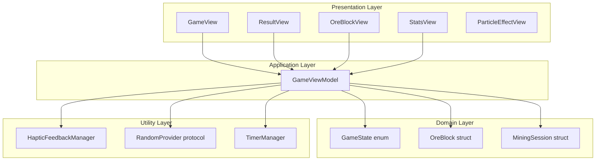
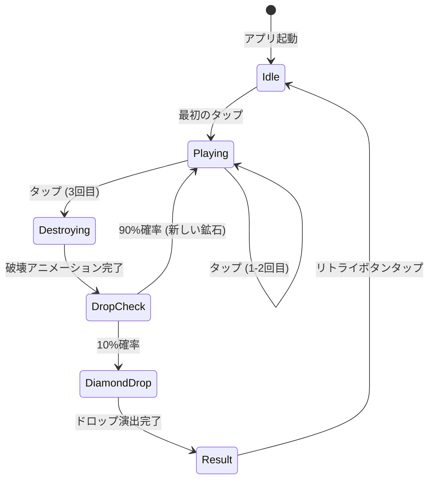
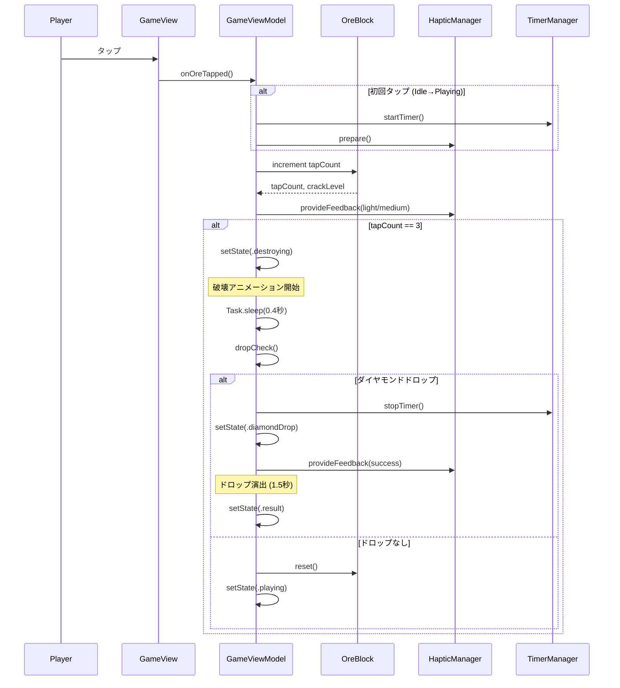
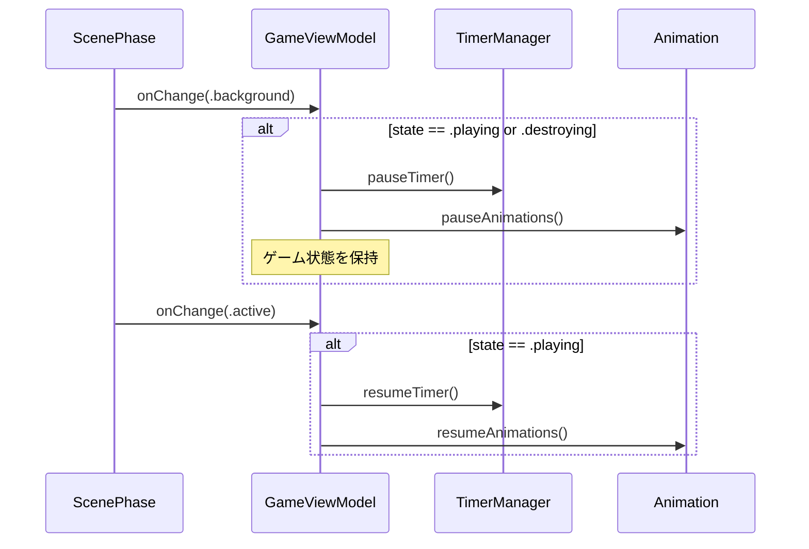

# Technical Design Document

## Overview

本設計は、マインクラフト風のダイヤモンド鉱石採掘体験を提供するiOSネイティブアプリケーションを実現する。プレイヤーは鉱石をタップして採掘し、10%の確率でダイヤモンドのドロップを目指す。タイムアタック要素により、繰り返しプレイしたくなる中毒性のあるゲームプレイを提供する。

**Purpose**: シンプルで中毒性のある採掘ゲーム体験をSwiftUI + Combineを活用したモダンなiOSアプリとして実現する。

**Users**: iOSユーザー（iPhone縦画面専用）が暇つぶし・リラクゼーション目的でカジュアルにプレイする。マインクラフトファン層にもアピールする。

**Impact**: 新規アプリケーションのため、既存システムへの変更はなし。

### Goals
- 3回タップで鉱石を採掘する直感的なゲームプレイの実現
- 10%のダイヤモンドドロップ率による運要素とリプレイ性の確保
- リアルタイムタイマーと採掘数の統計トラッキング
- SwiftUI標準アニメーションとハプティックフィードバックによる高品質なUX
- MVVMアーキテクチャによるテスタブルで保守性の高いコードベース

### Non-Goals
- マルチプレイヤー対応
- 複数ステージ・難易度設定（第一ステージのみ実装）
- サーバーサイドランキング・リーダーボード
- iPad最適化（iPhoneアプリとして動作）
- 横画面対応

## Architecture

### Architecture Pattern & Boundary Map

**Selected Pattern**: MVVM (Model-View-ViewModel) + @Observable

**Rationale**:
- SwiftUI標準パターンとして確立
- テスタビリティと保守性のバランスが最適
- @Observableマクロによりボイラープレートコード削減
- Combineへの依存を最小化（タイマー処理のみ使用）

**Domain Boundaries**:
- **Presentation Layer**: SwiftUI Views（画面表示、ユーザーインタラクション）
- **Application Layer**: ViewModels（ビジネスロジック、状態管理）
- **Domain Layer**: Models（ドメインエンティティ、ゲームルール）
- **Utility Layer**: 共通処理（ハプティック、乱数生成、拡張機能）



**Architecture Integration**:
- MVVMパターンによりView層とビジネスロジックを完全分離
- ドメインモデル（OreBlock, MiningSession）は純粋なSwift structとして定義
- ステアリング原則（Protocol-Oriented Programming）を維持
- 新規コンポーネントは責任単一性を遵守

**Steering Compliance**:
- MVVM Architecture: ViewとLogicを分離
- ObservableObject: ViewModelは@Publishedプロパティで状態を公開
- Protocol-Oriented: RandomProviderをプロトコル化してテスタビリティ向上
- Dependency Injection: ViewModelへの依存注入でテスト容易に

### Technology Stack & Alignment

| Layer | Choice / Version | Role in Feature | Notes |
|-------|------------------|-----------------|-------|
| UI Framework | SwiftUI (iOS 16+) | 宣言的UI構築、アニメーション、レイアウト | ステアリング準拠 |
| Reactive Framework | Combine | タイマー管理、非同期イベント処理 | 最小限の使用（タイマーのみ） |
| Haptics | UIKit.UIFeedbackGenerator | ハプティックフィードバック（タップ、破壊、ドロップ） | Core HapticsではなくシンプルなAPIを使用 |
| Animation | SwiftUI.Animation + Canvas | 破壊アニメーション、パーティクル、画面遷移 | TimelineView + Canvasで高パフォーマンス |
| Language | Swift 5.9+ | タイプセーフ、@Observable対応 | strict type checking |
| Testing | XCTest | 単体テスト、UI テスト | ゲームロジックの網羅的テスト |

**Alignment with Steering**:
- SwiftUI + Combineは技術スタック定義と完全一致
- MVVM + Combineでリアクティブな状態管理
- @Observableマクロで2025年のSwiftUIベストプラクティスに準拠

## System Flows

### ゲームプレイフロー（状態遷移）



**Key Decisions**:
- 状態遷移はGameState enumで明示的に管理
- Destroyingは一時的な状態（アニメーション再生中）
- DropCheckは内部状態（UI非表示）
- タイマーはPlaying状態でのみ動作

### 鉱石タップ処理フロー



### バックグラウンド/フォアグラウンド処理



## Requirements Traceability

| Requirement | Summary | Components | Interfaces | Flows |
|-------------|---------|------------|------------|-------|
| 1 | 鉱石採掘メカニクス | GameViewModel, OreBlock, OreBlockView | onOreTapped(), OreBlock.increment() | タップ処理フロー |
| 2 | ダイヤモンドドロップシステム | GameViewModel, RandomProvider | dropCheck(), RandomProvider.random() | タップ処理フロー（ドロップ判定） |
| 3 | タイマー機能 | TimerManager, GameViewModel | startTimer(), stopTimer(), pauseTimer() | ゲームプレイフロー |
| 4 | 採掘統計トラッキング | MiningSession, GameViewModel | incrementOreCount(), reset() | タップ処理フロー |
| 5 | タップ進捗インジケーター | StatsView, OreBlock | tapCount @Published | 自動バインディング（SwiftUI） |
| 6 | リザルト画面 | ResultView, GameViewModel | reset(), setState(.idle) | ゲームプレイフロー（Result→Idle） |
| 7 | ゲームフロー管理 | GameState enum, GameViewModel | setState(), state @Published | ゲームプレイフロー（全体） |
| 8 | ビジュアル演出 | OreBlockView, ParticleEffectView | withAnimation, Canvas API | タップ処理フロー（アニメーション） |
| 9 | ハプティックフィードバック | HapticFeedbackManager | prepare(), provideFeedback() | タップ処理フロー |
| 10 | 初回起動とアイドル状態UI | GameView, GameViewModel | state == .idle | ゲームプレイフロー（初期状態） |
| 11 | アニメーションとタイミング仕様 | GameViewModel, OreBlockView | withAnimation, Task.sleep() | タップ処理フロー（タイミング制御） |
| 12 | デバイス対応とレイアウト | GameView, App設定 | .ignoresSafeArea(edges: [])の逆 | アプリ全体 |
| 13 | タップ判定仕様 | OreBlockView | .onTapGesture | タップ処理フロー（入力判定） |
| 14 | バックグラウンド動作 | GameViewModel, ScenePhase | .onChange(.scenePhase) | バックグラウンドフロー |

## Components and Interfaces

### Component Summary

| Component | Domain/Layer | Intent | Req Coverage | Key Dependencies (P0/P1) | Contracts |
|-----------|--------------|--------|--------------|--------------------------|-----------|
| GameViewModel | Application | ゲーム状態管理、ユーザーインタラクション処理 | 1-14 | OreBlock (P0), MiningSession (P0), TimerManager (P0), HapticManager (P1), RandomProvider (P0) | State |
| GameView | Presentation | メインゲーム画面、レイアウト統合 | 1, 5, 10, 12, 13 | GameViewModel (P0) | - |
| ResultView | Presentation | リザルト表示、リトライ機能 | 6 | GameViewModel (P0) | - |
| OreBlockView | Presentation | 鉱石ビジュアル、ヒビ表示、タップ判定 | 1, 8, 11, 13 | GameViewModel (P0) | - |
| StatsView | Presentation | タイマー・採掘数・タップ進捗表示 | 3, 4, 5 | GameViewModel (P0) | - |
| ParticleEffectView | Presentation | パーティクルエフェクト描画 | 8, 11 | - | - |
| GameState | Domain | ゲーム状態enum | 7 | - | - |
| OreBlock | Domain | 鉱石ドメインモデル | 1, 5, 8 | - | - |
| MiningSession | Domain | 採掘セッション統計 | 3, 4 | - | - |
| TimerManager | Utility | 高精度タイマー管理 | 3, 14 | Combine.Timer (P0) | Service |
| HapticFeedbackManager | Utility | ハプティックフィードバック制御 | 9 | UIKit.UIFeedbackGenerator (P0) | Service |
| RandomProvider | Utility | 乱数生成プロトコル | 2 | - | Service |

### Application Layer

#### GameViewModel

| Field | Detail |
|-------|--------|
| Intent | アプリケーション全体の状態管理とゲームロジックの調整 |
| Requirements | 1, 2, 3, 4, 5, 6, 7, 8, 9, 10, 11, 14 |

**Responsibilities & Constraints**
- ゲーム状態遷移（idle/playing/destroying/diamondDrop/result）の管理
- ユーザーインタラクション（タップ、リトライ）の処理
- ドメインモデル（OreBlock, MiningSession）の調整
- バックグラウンド/フォアグラウンド処理

**Dependencies**
- Inbound: GameView, ResultView, OreBlockView, StatsView — 状態購読とアクション呼び出し (P0)
- Outbound: OreBlock — タップカウント管理 (P0)
- Outbound: MiningSession — 統計トラッキング (P0)
- Outbound: TimerManager — タイマー制御 (P0)
- Outbound: HapticFeedbackManager — ハプティック制御 (P1)
- Outbound: RandomProvider — ドロップ判定 (P0)

**Contracts**: [x] State

##### State Management
- **State model**:
```swift
@Observable
class GameViewModel {
    var state: GameState = .idle
    var currentOreBlock: OreBlock = OreBlock()
    var miningSession: MiningSession = MiningSession()

    private(set) var timerManager: TimerManager
    private(set) var hapticManager: HapticFeedbackManager
    private let randomProvider: RandomProvider

    init(
        timerManager: TimerManager = TimerManager(),
        hapticManager: HapticFeedbackManager = HapticFeedbackManager(),
        randomProvider: RandomProvider = SystemRandomProvider()
    ) {
        self.timerManager = timerManager
        self.hapticManager = hapticManager
        self.randomProvider = randomProvider
    }
}

enum GameState: Equatable {
    case idle
    case playing
    case destroying
    case diamondDrop
    case result
}
```

- **Persistence & consistency**: インメモリのみ（永続化なし）
- **Concurrency strategy**: @MainActor属性によりメインスレッドで実行

**Implementation Notes**
- **Integration**: ScenePhaseの.onChange()でバックグラウンド/フォアグラウンドを検知
- **Validation**: タップ処理は状態チェック（idle/playingのみ受付、destroying/diamondDrop/resultは無視）
- **Risks**: アニメーション時間とTask.sleep()の同期ずれ → 定数化で対応

### Domain Layer

#### GameState

| Field | Detail |
|-------|--------|
| Intent | ゲームの状態を表現するenum |
| Requirements | 7 |

```swift
enum GameState: Equatable {
    case idle       // アイドル状態（起動直後、リトライ後）
    case playing    // プレイ中（タップ受付、タイマー動作）
    case destroying // 破壊アニメーション再生中（タップ無効）
    case diamondDrop // ダイヤモンドドロップ演出中（タップ無効）
    case result     // リザルト表示中
}
```

#### OreBlock

| Field | Detail |
|-------|--------|
| Intent | 鉱石のドメインロジックをカプセル化 |
| Requirements | 1, 5, 8 |

```swift
struct OreBlock {
    private(set) var tapCount: Int = 0

    var crackLevel: CrackLevel {
        switch tapCount {
        case 0: return .none
        case 1: return .small
        case 2: return .large
        default: return .broken
        }
    }

    mutating func increment() {
        tapCount += 1
    }

    mutating func reset() {
        tapCount = 0
    }
}

enum CrackLevel {
    case none   // ヒビなし
    case small  // 小ヒビ (1-2本)
    case large  // 大ヒビ (3本以上)
    case broken // 破壊
}
```

#### MiningSession

| Field | Detail |
|-------|--------|
| Intent | 採掘セッションの統計を管理 |
| Requirements | 3, 4 |

```swift
struct MiningSession {
    private(set) var oreCount: Int = 0
    private(set) var elapsedTime: TimeInterval = 0.0

    mutating func incrementOreCount() {
        oreCount += 1
    }

    mutating func updateElapsedTime(_ time: TimeInterval) {
        elapsedTime = time
    }

    mutating func reset() {
        oreCount = 0
        elapsedTime = 0.0
    }
}
```

### Utility Layer

#### TimerManager

| Field | Detail |
|-------|--------|
| Intent | 高精度タイマー管理とバックグラウンド対応 |
| Requirements | 3, 14 |

**Contracts**: [x] Service

##### Service Interface
```swift
@Observable
class TimerManager {
    private(set) var elapsedTime: TimeInterval = 0.0
    private var timerSubscription: AnyCancellable?
    private var startDate: Date?
    private var pausedElapsedTime: TimeInterval = 0.0

    func startTimer()
    func stopTimer()
    func pauseTimer()
    func resumeTimer()
    func reset()

    var formattedTime: String {
        let minutes = Int(elapsedTime) / 60
        let seconds = Int(elapsedTime) % 60
        return String(format: "%02d:%02d", minutes, seconds)
    }
}
```

**Implementation Notes**
- **Integration**: Combine.Timerで1秒ごとにDate().timeIntervalSince(startDate)を計算
- **Validation**: pauseTimer()時に現在のelapsedTimeを保存、resumeTimer()時に加算
- **Risks**: バックグラウンド中のTimer停止 → ScenePhaseでpause/resume処理

#### HapticFeedbackManager

| Field | Detail |
|-------|--------|
| Intent | ハプティックフィードバックのライフサイクル管理 |
| Requirements | 9 |

**Contracts**: [x] Service

##### Service Interface
```swift
class HapticFeedbackManager {
    private var lightGenerator: UIImpactFeedbackGenerator?
    private var mediumGenerator: UIImpactFeedbackGenerator?
    private var notificationGenerator: UINotificationFeedbackGenerator?

    func prepare()
    func provideFeedback(_ type: HapticFeedbackType)
    func cleanup()
}

enum HapticFeedbackType {
    case light   // タップ (1-2回目)
    case medium  // 破壊 (3回目)
    case success // ダイヤモンドドロップ
}
```

**Implementation Notes**
- **Integration**: prepare()はGameState.playing遷移時、cleanup()はstate.result遷移時に呼び出し
- **Validation**: UIDevice.current.userInterfaceIdiom == .phoneでデバイス判定
- **Risks**: Simulator非対応 → 実機テスト必須

#### RandomProvider

| Field | Detail |
|-------|--------|
| Intent | ドロップ判定の乱数生成を抽象化（テスト容易性） |
| Requirements | 2 |

**Contracts**: [x] Service

##### Service Interface
```swift
protocol RandomProvider {
    func random() -> Double // 0.0 ~ 1.0
}

struct SystemRandomProvider: RandomProvider {
    func random() -> Double {
        Double.random(in: 0.0...1.0)
    }
}

// テスト用
struct MockRandomProvider: RandomProvider {
    let fixedValue: Double
    func random() -> Double { fixedValue }
}
```

### Presentation Layer

#### GameView

| Field | Detail |
|-------|--------|
| Intent | メインゲーム画面のレイアウト統合 |
| Requirements | 1, 5, 10, 12, 13 |

**Implementation Notes**
- ZStackでOreBlockView + StatsView + "タップして開始"ヒントを配置
- セーフエリア考慮: .safeAreaInset()でUI要素を配置
- ScenePhase監視: .onChange(.scenePhase)でViewModel.pause()/resume()を呼び出し

#### OreBlockView

| Field | Detail |
|-------|--------|
| Intent | 鉱石ビジュアル、ヒビ表示、タップ判定、パーティクル表示 |
| Requirements | 1, 8, 11, 13 |

**Implementation Notes**
- 鉱石画像: Assets.xcassetsから読み込み（グレーベース + 青い鉱脈）
- ヒビ表示: Overlay でCrackLevelに応じた黒線を描画
- タップ判定: .onTapGesture { viewModel.onOreTapped() }（矩形領域全体）
- 破壊アニメーション: .scaleEffect + .opacity + withAnimation(.easeOut(duration: 0.4))
- パーティクル: ParticleEffectViewをZStackで重ねる

#### ParticleEffectView

| Field | Detail |
|-------|--------|
| Intent | Canvas APIを使用した破壊パーティクルの描画 |
| Requirements | 8, 11 |

**Implementation Notes**
- TimelineView + Canvasで60FPS維持
- 4-8個のRectangle破片を放射状に飛散（画面幅30%以内）
- アニメーション時間: 0.4秒（破壊アニメーションと同期）

## Data Models

### Domain Model

本アプリケーションはシンプルなゲームロジックのため、複雑なドメインモデルは不要。以下の3つのエンティティで構成:

- **OreBlock**: 鉱石の状態（tapCount, crackLevel）
- **MiningSession**: 採掘セッションの統計（oreCount, elapsedTime）
- **GameState**: ゲーム全体の状態（enum）

**Business Rules & Invariants**:
- tapCountは0〜3の範囲内
- oreCountは非負整数
- elapsedTimeは非負数
- ドロップ率は10%固定

### Logical Data Model

**Structure Definition**:
すべてインメモリデータとして管理（永続化なし）。

```swift
// GameViewModel内で管理される状態
state: GameState              // 現在のゲーム状態
currentOreBlock: OreBlock     // 現在の鉱石
miningSession: MiningSession  // 現在のセッション統計
```

**Consistency & Integrity**:
- すべてのデータはGameViewModelが所有
- struct（値型）により不変性を保証
- 状態遷移はGameViewModelのメソッド経由のみ

## Error Handling

### Error Strategy

本アプリケーションはオフラインで動作し、外部APIや永続化がないため、エラーハンドリングは最小限。

### Error Categories and Responses

**User Errors**:
- なし（ユーザー入力は鉱石タップのみ、常に有効）

**System Errors**:
- ハプティック非対応デバイス → 無視（視覚フィードバックで代替）
- アニメーション失敗 → フォールバック（即座に次状態へ遷移）

**Business Logic Errors**:
- tapCount > 3 → reset()で初期化
- 負のelapsedTime → max(0, time)でクランプ

### Monitoring

- Xcodeデバッグコンソールでログ出力（開発時のみ）
- 実機テストでのハプティック応答確認

## Testing Strategy

### Unit Tests
- **GameViewModel状態遷移テスト**: idle→playing→destroying→result の完全なフロー
- **OreBlock.increment()テスト**: tapCountとcrackLevelの対応
- **MiningSession統計テスト**: incrementOreCount(), updateElapsedTime()
- **RandomProviderモックテスト**: 固定値でドロップ判定を検証
- **TimerManager pause/resume テスト**: pausedElapsedTimeの正確性

### Integration Tests
- **タップ→ドロップ→リザルトフロー**: E2Eシナリオ
- **バックグラウンド/フォアグラウンド遷移**: タイマー一時停止/再開
- **アニメーション同期**: 破壊→ドロップ判定→新鉱石のタイミング

### UI Tests (XCTest)
- **初回起動UI確認**: アイドル状態の表示要素
- **タップ操作**: 1, 2, 3回タップ時のUI変化
- **リザルト画面**: リトライボタンの動作

### Performance Tests
- **60FPS維持確認**: パーティクル再生中のフレームレート計測
- **メモリ使用量**: 長時間プレイ時のメモリリーク検出

## Security Considerations

本アプリケーションは個人情報を扱わず、ネットワーク通信もないため、特別なセキュリティ考慮事項なし。

## Performance & Scalability

### Target Metrics
- **60 FPS維持**: パーティクルアニメーション再生中
- **タップ応答時間**: < 16ms（1フレーム以内）
- **タイマー精度**: ± 0.1秒以内

### Optimization Techniques
- Canvas APIによるパーティクル描画（GPU最適化）
- @Observableによるビュー更新最小化
- 破片数制限（4-8個）
- Release buildでのコンパイル最適化
