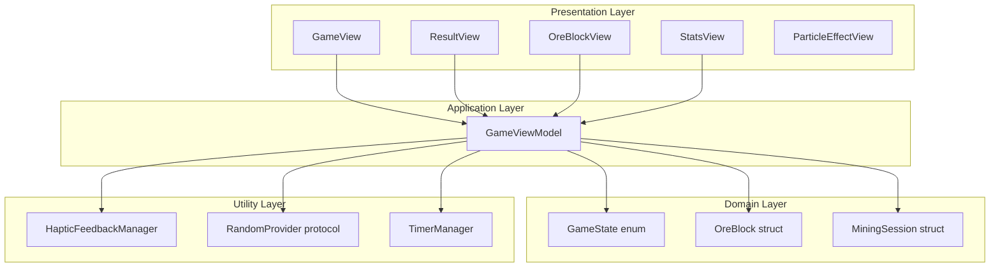
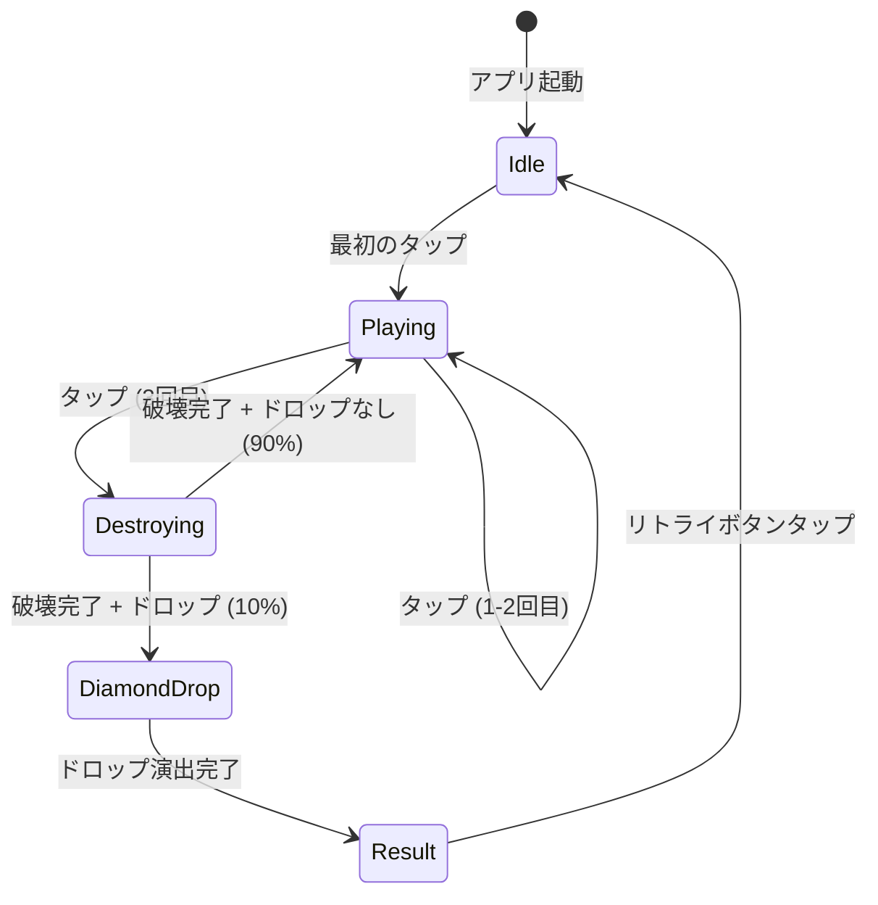
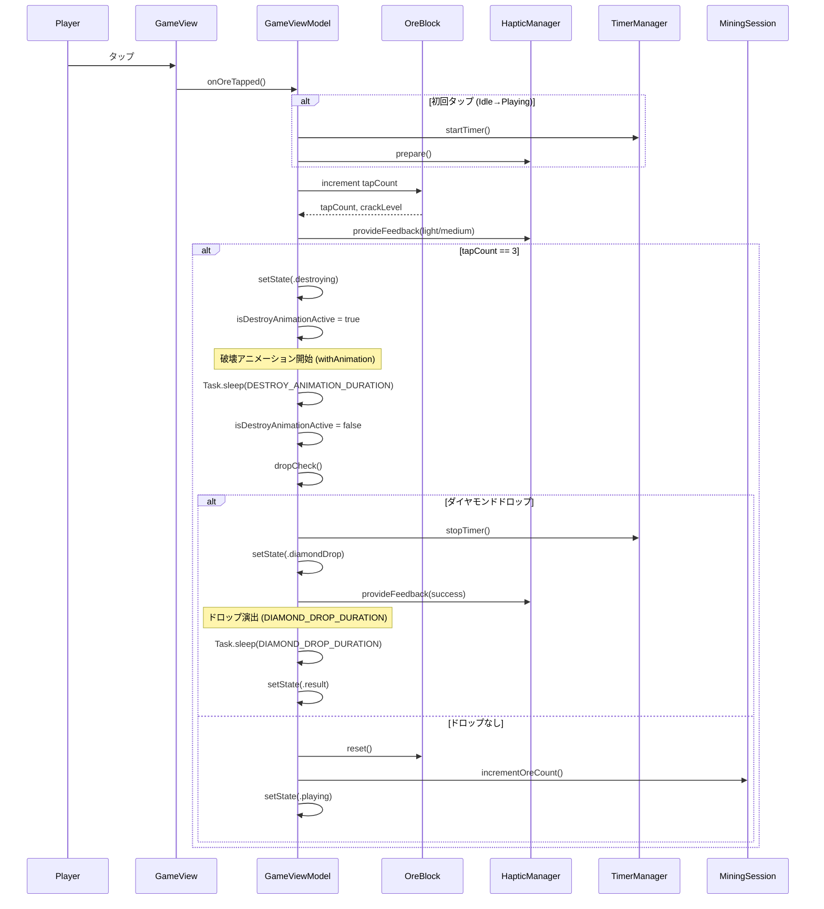
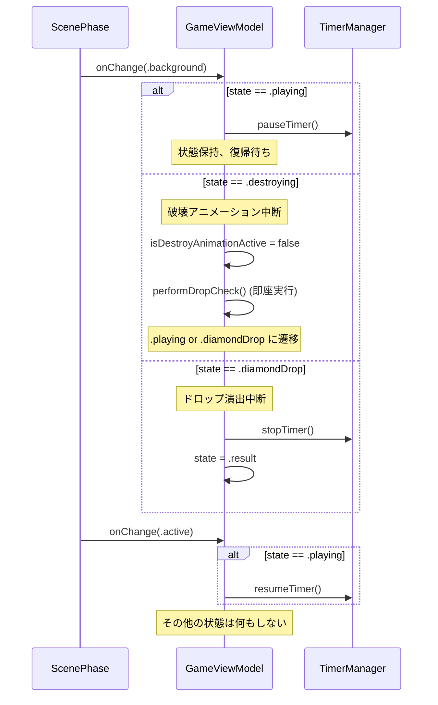

# Technical Design Document

## Overview

本設計は、マインクラフト風のダイヤモンド鉱石採掘体験を提供するiOSネイティブアプリケーションを実現する。プレイヤーは鉱石をタップして採掘し、10%の確率でダイヤモンドのドロップを目指す。タイムアタック要素により、繰り返しプレイしたくなる中毒性のあるゲームプレイを提供する。

**Purpose**: シンプルで中毒性のある採掘ゲーム体験をSwiftUI + Combineを活用したモダンなiOSアプリとして実現する。

**Users**: iOSユーザー（iPhone縦画面専用）が暇つぶし・リラクゼーション目的でカジュアルにプレイする。マインクラフトファン層にもアピールする。

**Impact**: 新規アプリケーションのため、既存システムへの変更はなし。

### Goals
- 3回タップで鉱石を採掘する直感的なゲームプレイの実現
- 10%のダイヤモンドドロップ率による運要素とリプレイ性の確保
- リアルタイムタイマーと採掘数の統計トラッキング
- SwiftUI標準アニメーションとハプティックフィードバックによる高品質なUX
- MVVMアーキテクチャによるテスタブルで保守性の高いコードベース

### Non-Goals
- マルチプレイヤー対応
- 複数ステージ・難易度設定（第一ステージのみ実装）
- サーバーサイドランキング・リーダーボード
- iPad最適化（iPhoneアプリとして動作）
- 横画面対応

## Architecture

### Architecture Pattern & Boundary Map

**Selected Pattern**: MVVM (Model-View-ViewModel) + @Observable

**Rationale**:
- SwiftUI標準パターンとして確立
- テスタビリティと保守性のバランスが最適
- @Observableマクロによりボイラープレートコード削減
- Combineへの依存を最小化（タイマー処理のみ使用）

**Domain Boundaries**:
- **Presentation Layer**: SwiftUI Views（画面表示、ユーザーインタラクション）
- **Application Layer**: ViewModels（ビジネスロジック、状態管理）
- **Domain Layer**: Models（ドメインエンティティ、ゲームルール）
- **Utility Layer**: 共通処理（ハプティック、乱数生成、拡張機能）



**Architecture Integration**:
- MVVMパターンによりView層とビジネスロジックを完全分離
- ドメインモデル（OreBlock, MiningSession）は純粋なSwift structとして定義
- ステアリング原則（Protocol-Oriented Programming）を維持
- 新規コンポーネントは責任単一性を遵守

**Steering Compliance**:
- MVVM Architecture: ViewとLogicを分離
- ObservableObject: ViewModelは@Publishedプロパティで状態を公開
- Protocol-Oriented: RandomProviderをプロトコル化してテスタビリティ向上
- Dependency Injection: ViewModelへの依存注入でテスト容易に

### Technology Stack & Alignment

| Layer | Choice / Version | Role in Feature | Notes |
|-------|------------------|-----------------|-------|
| UI Framework | SwiftUI (iOS 16+) | 宣言的UI構築、アニメーション、レイアウト | ステアリング準拠 |
| Reactive Framework | Combine | タイマー管理、非同期イベント処理 | 最小限の使用（タイマーのみ） |
| Haptics | UIKit.UIFeedbackGenerator | ハプティックフィードバック（タップ、破壊、ドロップ） | Core HapticsではなくシンプルなAPIを使用 |
| Animation | SwiftUI.Animation + Canvas | 破壊アニメーション、パーティクル、画面遷移 | TimelineView + Canvasで高パフォーマンス |
| Language | Swift 5.9+ | タイプセーフ、@Observable対応 | strict type checking |
| Testing | XCTest | 単体テスト、UI テスト | ゲームロジックの網羅的テスト |

**Alignment with Steering**:
- SwiftUI + Combineは技術スタック定義と完全一致
- MVVM + Combineでリアクティブな状態管理
- @Observableマクロで2025年のSwiftUIベストプラクティスに準拠

## System Flows

### ゲームプレイフロー（状態遷移）



**Key Decisions**:
- 状態遷移はGameState enumで明示的に管理（5状態のみ）
- Destroyingは破壊アニメーション再生中の一時状態
- **DropCheckはGameStateに存在しない**（Destroying状態内でドロップ判定を実行し、即座に次状態へ遷移）
- DiamondDropはダイヤモンドドロップ演出専用の状態（破壊アニメーションとは別の演出）
- タイマーはPlaying/Destroying状態でのみ動作

**Destroying vs DiamondDrop の明確な区別**:
- **Destroying**: 鉱石が砕ける破壊アニメーション（0.4秒、パーティクル飛散）
- **DiamondDrop**: ダイヤモンド出現の特別演出（1.5秒、輝きエフェクト、タイマー停止後）
- 両者は連続して発生するが、別々の演出として独立

**状態遷移のタイミング仕様**:
1. Playing → Destroying: 3回目のタップ即座
2. Destroying → Playing/DiamondDrop: 破壊アニメーション完了時（Task.sleep(0.4)後、アニメーション完了イベントは使用しない）
3. DiamondDrop → Result: ドロップ演出完了時（Task.sleep(1.5)後）

### 鉱石タップ処理フロー



### アニメーション同期方式（重要）

**採用方式**: Task.sleep() を事実上の同期タイミングとして使用

**設計判断の根拠**:
- SwiftUIはアニメーション完了イベントを標準で提供しない
- `AnimationCompletionObserver`パターンは複雑性が増し、メンテナンスコストが高い
- 本アプリのアニメーションは単純な0.4秒/1.5秒の固定時間であり、複雑な物理演算は不要
- Task.sleep()とwithAnimationの時間を定数化することで、ズレを最小化

**同期の保証方法**:
```swift
// アニメーション時間定数（一か所で管理）
enum AnimationConstants {
    static let destroyDuration: TimeInterval = 0.4
    static let diamondDropDuration: TimeInterval = 1.5
    static let crackTransitionDuration: TimeInterval = 0.15
    static let startHintFadeDuration: TimeInterval = 1.0
}

// 破壊処理の実装パターン
func processDestruction() async {
    // 1. 状態を.destroyingに変更（UI側でアニメーション開始）
    state = .destroying
    isDestroyAnimationActive = true

    // 2. アニメーションと同じ時間だけ待機
    //    ※withAnimationのdurationと完全に一致させる
    try? await Task.sleep(for: .seconds(AnimationConstants.destroyDuration))

    // 3. アニメーション完了とみなして次処理
    isDestroyAnimationActive = false
    await performDropCheck()
}
```

**SwiftUI View側の実装**:
```swift
OreBlockView()
    .scaleEffect(viewModel.isDestroyAnimationActive ? 0.0 : 1.0)
    .opacity(viewModel.isDestroyAnimationActive ? 0.0 : 1.0)
    .animation(
        .easeOut(duration: AnimationConstants.destroyDuration),
        value: viewModel.isDestroyAnimationActive
    )
```

**注意事項**:
- Task.sleep()とwithAnimationのdurationは**必ず同じ定数を参照**すること
- システム負荷でアニメーションが遅延しても、状態遷移はTask.sleep()基準で行う
- アニメーションの視覚的完了とロジック的完了が±数msずれる可能性は許容する

### バックグラウンド/フォアグラウンド処理

##### バックグラウンド中のアニメーション挙動（確定仕様）

**設計方針**: バックグラウンド移行時に破壊アニメーション中であれば、即座に破壊完了扱いにする

**設計判断の根拠**:
- SwiftUIアニメーションはバックグラウンドで停止し、フォアグラウンド復帰時に不確定な状態になる
- Task.sleep()もバックグラウンドでは中断される可能性がある
- パーティクル（TimelineView）もバックグラウンドでは更新されない
- 「中途半端な状態」を避けるため、シンプルに「即座に完了扱い」とする

**具体的な挙動**:

| バックグラウンド移行時の状態 | 処理内容 |
|--------------------------|---------|
| .idle | 何もしない |
| .playing | タイマーを一時停止、フォアグラウンド復帰時に再開 |
| .destroying | **即座に破壊完了扱い**。ドロップ判定を実行し、.playing or .diamondDrop に遷移 |
| .diamondDrop | **即座にドロップ演出完了扱い**。.result に遷移 |
| .result | 何もしない |



**実装パターン**:
```swift
@Observable
class GameViewModel {
    private var destroyTask: Task<Void, Never>?
    private var diamondDropTask: Task<Void, Never>?

    func handleScenePhaseChange(_ phase: ScenePhase) {
        switch phase {
        case .background:
            handleBackgroundTransition()
        case .active:
            handleForegroundTransition()
        default:
            break
        }
    }

    private func handleBackgroundTransition() {
        switch state {
        case .playing:
            timerManager.pauseTimer()

        case .destroying:
            // 破壊アニメーションを即座に完了扱い
            destroyTask?.cancel()
            destroyTask = nil
            isDestroyAnimationActive = false
            performDropCheckSync()  // 同期的に実行

        case .diamondDrop:
            // ドロップ演出を即座に完了扱い
            diamondDropTask?.cancel()
            diamondDropTask = nil
            state = .result

        default:
            break
        }
    }

    private func handleForegroundTransition() {
        if state == .playing {
            timerManager.resumeTimer()
        }
        // その他の状態は何もしない（.resultなら結果表示のまま）
    }

    private func performDropCheckSync() {
        let shouldDrop = randomProvider.random() < 0.10
        if shouldDrop {
            timerManager.stopTimer()
            state = .result  // .diamondDropをスキップして直接.resultへ
            hapticManager.provideFeedback(.success)
        } else {
            state = .playing
        }
    }
}
```

**注意事項**:
- バックグラウンド移行時に .destroying → .diamondDrop の場合、ドロップ演出はスキップして .result へ直接遷移
- ユーザー体験として「バックグラウンドから戻ったら結果が出ていた」は許容する
- フォアグラウンド復帰時に新たなアニメーションは開始しない（状態を引き継ぐ）

## Requirements Traceability

| Requirement | Summary | Components | Interfaces | Flows |
|-------------|---------|------------|------------|-------|
| 1 | 鉱石採掘メカニクス | GameViewModel, OreBlock, OreBlockView | onOreTapped(), OreBlock.increment() | タップ処理フロー |
| 2 | ダイヤモンドドロップシステム | GameViewModel, RandomProvider | dropCheck(), RandomProvider.random() | タップ処理フロー（ドロップ判定） |
| 3 | タイマー機能 | TimerManager, GameViewModel | startTimer(), stopTimer(), pauseTimer() | ゲームプレイフロー |
| 4 | 採掘統計トラッキング | MiningSession, GameViewModel | incrementOreCount(), reset() | タップ処理フロー |
| 5 | タップ進捗インジケーター | StatsView, OreBlock | tapCount @Published | 自動バインディング（SwiftUI） |
| 6 | リザルト画面 | ResultView, GameViewModel | reset(), setState(.idle) | ゲームプレイフロー（Result→Idle） |
| 7 | ゲームフロー管理 | GameState enum, GameViewModel | setState(), state @Published | ゲームプレイフロー（全体） |
| 8 | ビジュアル演出 | OreBlockView, ParticleEffectView | withAnimation, Canvas API | タップ処理フロー（アニメーション） |
| 9 | ハプティックフィードバック | HapticFeedbackManager | prepare(), provideFeedback() | タップ処理フロー |
| 10 | 初回起動とアイドル状態UI | GameView, GameViewModel | state == .idle | ゲームプレイフロー（初期状態） |
| 11 | アニメーションとタイミング仕様 | GameViewModel, OreBlockView | withAnimation, Task.sleep() | タップ処理フロー（タイミング制御） |
| 12 | デバイス対応とレイアウト | GameView, App設定 | .ignoresSafeArea(edges: [])の逆 | アプリ全体 |
| 13 | タップ判定仕様 | OreBlockView | .onTapGesture | タップ処理フロー（入力判定） |
| 14 | バックグラウンド動作 | GameViewModel, ScenePhase | .onChange(.scenePhase) | バックグラウンドフロー |

## Components and Interfaces

### Component Summary

| Component | Domain/Layer | Intent | Req Coverage | Key Dependencies (P0/P1) | Contracts |
|-----------|--------------|--------|--------------|--------------------------|-----------|
| GameViewModel | Application | ゲーム状態管理、ユーザーインタラクション処理 | 1-14 | OreBlock (P0), MiningSession (P0), TimerManager (P0), HapticManager (P1), RandomProvider (P0) | State |
| GameView | Presentation | メインゲーム画面、レイアウト統合 | 1, 5, 10, 12, 13 | GameViewModel (P0) | - |
| ResultView | Presentation | リザルト表示、リトライ機能 | 6 | GameViewModel (P0) | - |
| OreBlockView | Presentation | 鉱石ビジュアル、ヒビ表示、タップ判定 | 1, 8, 11, 13 | GameViewModel (P0) | - |
| StatsView | Presentation | タイマー・採掘数・タップ進捗表示 | 3, 4, 5 | GameViewModel (P0) | - |
| ParticleEffectView | Presentation | パーティクルエフェクト描画 | 8, 11 | - | - |
| GameState | Domain | ゲーム状態enum | 7 | - | - |
| OreBlock | Domain | 鉱石ドメインモデル | 1, 5, 8 | - | - |
| MiningSession | Domain | 採掘セッション統計 | 3, 4 | - | - |
| TimerManager | Utility | 高精度タイマー管理 | 3, 14 | Combine.Timer (P0) | Service |
| HapticFeedbackManager | Utility | ハプティックフィードバック制御 | 9 | UIKit.UIFeedbackGenerator (P0) | Service |
| RandomProvider | Utility | 乱数生成プロトコル | 2 | - | Service |

### Application Layer

#### GameViewModel

| Field | Detail |
|-------|--------|
| Intent | アプリケーション全体の状態管理とゲームロジックの調整 |
| Requirements | 1, 2, 3, 4, 5, 6, 7, 8, 9, 10, 11, 14 |

**Responsibilities & Constraints**
- ゲーム状態遷移（idle/playing/destroying/diamondDrop/result）の管理
- ユーザーインタラクション（タップ、リトライ）の処理
- ドメインモデル（OreBlock, MiningSession）の調整
- バックグラウンド/フォアグラウンド処理

**Dependencies**
- Inbound: GameView, ResultView, OreBlockView, StatsView — 状態購読とアクション呼び出し (P0)
- Outbound: OreBlock — タップカウント管理 (P0)
- Outbound: MiningSession — 統計トラッキング (P0)
- Outbound: TimerManager — タイマー制御 (P0)
- Outbound: HapticFeedbackManager — ハプティック制御 (P1)
- Outbound: RandomProvider — ドロップ判定 (P0)

**Contracts**: [x] State

##### State Management
- **State model**:
```swift
@Observable
class GameViewModel {
    var state: GameState = .idle
    var currentOreBlock: OreBlock = OreBlock()
    var miningSession: MiningSession = MiningSession()

    private(set) var timerManager: TimerManager
    private(set) var hapticManager: HapticFeedbackManager
    private let randomProvider: RandomProvider

    init(
        timerManager: TimerManager = TimerManager(),
        hapticManager: HapticFeedbackManager = HapticFeedbackManager(),
        randomProvider: RandomProvider = SystemRandomProvider()
    ) {
        self.timerManager = timerManager
        self.hapticManager = hapticManager
        self.randomProvider = randomProvider
    }
}

enum GameState: Equatable {
    case idle
    case playing
    case destroying
    case diamondDrop
    case result
}
```

- **Persistence & consistency**: インメモリのみ（永続化なし）
- **Concurrency strategy**: @MainActor属性によりメインスレッドで実行

**Implementation Notes**
- **Integration**: ScenePhaseの.onChange()でバックグラウンド/フォアグラウンドを検知
- **Validation**: タップ処理は状態チェック（idle/playingのみ受付、destroying/diamondDrop/resultは無視）
- **Risks**: アニメーション時間とTask.sleep()の同期ずれ → 定数化で対応

### Domain Layer

#### GameState

| Field | Detail |
|-------|--------|
| Intent | ゲームの状態を表現するenum |
| Requirements | 7 |

```swift
enum GameState: Equatable {
    case idle       // アイドル状態（起動直後、リトライ後）
    case playing    // プレイ中（タップ受付、タイマー動作）
    case destroying // 破壊アニメーション再生中（タップ無効）
    case diamondDrop // ダイヤモンドドロップ演出中（タップ無効）
    case result     // リザルト表示中
}
```

#### OreBlock

| Field | Detail |
|-------|--------|
| Intent | 鉱石のドメインロジックをカプセル化 |
| Requirements | 1, 5, 8 |

##### 破壊状態の扱い（確定仕様）

**設計方針**: OreBlockは「タップ可能な状態」のみを表現し、破壊アニメーション表示はView層のローカル状態で管理

**ロジックとUIの分離**:
- OreBlock.tapCount == 3 になった瞬間、即座に OreBlock.reset() を呼び出す
- 破壊アニメーションは GameViewModel.isDestroyAnimationActive フラグで制御
- UI側は isDestroyAnimationActive == true の間、破壊エフェクトを表示
- OreBlock自体は常に「次にタップ可能な状態」を保持

**状態遷移のタイムライン**:
```
T+0.00s: タップ3回目
         → OreBlock.increment() → tapCount == 3
         → OreBlock.reset() → tapCount = 0 (即座にリセット)
         → MiningSession.incrementOreCount()
         → GameViewModel.isDestroyAnimationActive = true
         → state = .destroying

T+0.40s: Task.sleep(0.4)完了
         → isDestroyAnimationActive = false
         → dropCheck()実行
         → state = .playing or .diamondDrop

UI表示:
  T+0.00s〜T+0.40s: 破壊アニメーション表示（scaleEffect, opacity変化）
  T+0.40s〜: 新しい鉱石表示（isDestroyAnimationActiveがfalseになった瞬間）
```

**設計判断の根拠**:
- OreBlockはドメインロジックに集中（tapCount管理のみ）
- 破壊アニメーションはUIの関心事なのでView層で管理
- isDestroyAnimationActiveフラグによりUI状態とロジック状態を独立

```swift
struct OreBlock {
    private(set) var tapCount: Int = 0

    var crackLevel: CrackLevel {
        switch tapCount {
        case 0: return .none
        case 1: return .small
        case 2: return .large
        default: return .broken  // tapCount >= 3 は通常到達しない（即座にreset）
        }
    }

    /// タップ時に呼び出す。戻り値で破壊判定を行う
    mutating func increment() -> Bool {
        tapCount += 1
        return tapCount >= 3
    }

    mutating func reset() {
        tapCount = 0
    }
}

enum CrackLevel: Equatable {
    case none   // ヒビなし (tapCount == 0)
    case small  // 小ヒビ (tapCount == 1)
    case large  // 大ヒビ (tapCount == 2)
    case broken // 破壊 (tapCount >= 3、通常は到達しない)
}
```

**GameViewModelでの使用パターン**:
```swift
@Observable
class GameViewModel {
    var currentOreBlock: OreBlock = OreBlock()
    var isDestroyAnimationActive: Bool = false  // UI用フラグ

    func onOreTapped() {
        // ...
        let shouldDestroy = currentOreBlock.increment()

        if shouldDestroy {
            // 即座にリセット（次の鉱石として準備）
            currentOreBlock.reset()
            miningSession.incrementOreCount()

            // アニメーションフラグを立てる
            isDestroyAnimationActive = true
            state = .destroying

            Task {
                try? await Task.sleep(for: .seconds(AnimationConstants.destroyDuration))
                isDestroyAnimationActive = false
                await performDropCheck()
            }
        }
    }
}
```

#### MiningSession

| Field | Detail |
|-------|--------|
| Intent | 採掘セッションの統計を管理 |
| Requirements | 3, 4 |

```swift
struct MiningSession {
    private(set) var oreCount: Int = 0
    private(set) var elapsedTime: TimeInterval = 0.0

    mutating func incrementOreCount() {
        oreCount += 1
    }

    mutating func updateElapsedTime(_ time: TimeInterval) {
        elapsedTime = time
    }

    mutating func reset() {
        oreCount = 0
        elapsedTime = 0.0
    }
}
```

### Utility Layer

#### TimerManager

| Field | Detail |
|-------|--------|
| Intent | 高精度タイマー管理とバックグラウンド対応 |
| Requirements | 3, 14 |

**Contracts**: [x] Service

##### 精度方式（統一仕様）

**採用方式**: 内部は常にDate基準で高精度計測、Combine.TimerはUI更新トリガーのみ

**設計判断**:
- 内部時間は`Date().timeIntervalSince(startDate)`で常に高精度（±0.001秒）
- Combine.Timerは1秒ごとにUI更新をトリガーするだけ（時間計算には使用しない）
- これにより「UIは1秒刻み表示、内部は高精度」の両立を実現
- pauseTimer()時点の正確な経過時間を保持し、resumeTimer()で加算

##### Service Interface
```swift
@Observable
class TimerManager {
    // 外部公開プロパティ
    private(set) var elapsedTime: TimeInterval = 0.0  // 高精度計測値

    // 内部状態
    private var timerSubscription: AnyCancellable?
    private var startDate: Date?                       // 計測開始時刻
    private var accumulatedTime: TimeInterval = 0.0    // pause前の累積時間
    private var isRunning: Bool = false

    func startTimer() {
        guard !isRunning else { return }
        startDate = Date()
        isRunning = true
        // Combine.Timerは1秒ごとにUI更新をトリガー
        timerSubscription = Timer.publish(every: 1.0, on: .main, in: .common)
            .autoconnect()
            .sink { [weak self] _ in
                self?.updateElapsedTime()
            }
    }

    private func updateElapsedTime() {
        guard let start = startDate else { return }
        // 常にDate基準で計算（高精度）
        elapsedTime = accumulatedTime + Date().timeIntervalSince(start)
    }

    func pauseTimer() {
        guard isRunning else { return }
        // pause時点の正確な時間を保存
        if let start = startDate {
            accumulatedTime += Date().timeIntervalSince(start)
        }
        timerSubscription?.cancel()
        timerSubscription = nil
        startDate = nil
        isRunning = false
        elapsedTime = accumulatedTime
    }

    func resumeTimer() {
        guard !isRunning else { return }
        startTimer()  // accumulatedTimeは保持されたまま
    }

    func stopTimer() {
        updateElapsedTime()  // 最終時間を確定
        timerSubscription?.cancel()
        timerSubscription = nil
        isRunning = false
    }

    func reset() {
        timerSubscription?.cancel()
        timerSubscription = nil
        startDate = nil
        accumulatedTime = 0.0
        elapsedTime = 0.0
        isRunning = false
    }

    var formattedTime: String {
        let totalSeconds = Int(elapsedTime)
        let minutes = totalSeconds / 60
        let seconds = totalSeconds % 60
        return String(format: "%02d:%02d", minutes, seconds)
    }
}
```

**精度保証**:
- 内部elapsedTimeは±0.001秒の精度（Date基準）
- UI表示は1秒刻み（MM:SS形式）
- pause/resume時の累積誤差なし（accumulatedTimeで正確に保持）

**Implementation Notes**
- **Integration**: Combine.Timerは1秒ごとにupdateElapsedTime()を呼び出すトリガー
- **Validation**: pause時にaccumulatedTimeを保存、resume時は新しいstartDateから再計測
- **Risks**: バックグラウンド中のTimer停止 → ScenePhaseでpause/resume処理

#### HapticFeedbackManager

| Field | Detail |
|-------|--------|
| Intent | ハプティックフィードバックのライフサイクル管理 |
| Requirements | 9 |

**Contracts**: [x] Service

##### ライフサイクル仕様（確定）

**prepare()のタイミング**: GameState.idle → .playing 遷移時（初回タップ時）に一度だけ呼び出す

**cleanup()のタイミング**: GameState → .result 遷移時に呼び出す

**設計判断の根拠**:
- prepare()は呼び出しから数秒間のみ有効（Apple公式ドキュメント）
- ゲームセッション開始時にprepare()を呼び、セッション中（数秒〜数分）は有効状態を維持
- 各タップ直前にprepare()を呼んでも、レイテンシ改善効果はほぼない
- プレイ中は継続的にタップするため、prepare()の効果は持続する想定

##### Service Interface
```swift
class HapticFeedbackManager {
    private var lightGenerator: UIImpactFeedbackGenerator?
    private var mediumGenerator: UIImpactFeedbackGenerator?
    private var notificationGenerator: UINotificationFeedbackGenerator?
    private var isPrepared: Bool = false

    /// GameState.idle → .playing 遷移時に呼び出す（一度だけ）
    func prepare() {
        guard !isPrepared else { return }
        lightGenerator = UIImpactFeedbackGenerator(style: .light)
        mediumGenerator = UIImpactFeedbackGenerator(style: .medium)
        notificationGenerator = UINotificationFeedbackGenerator()

        lightGenerator?.prepare()
        mediumGenerator?.prepare()
        notificationGenerator?.prepare()
        isPrepared = true
    }

    /// タップ時に呼び出す（prepare()済みであれば低レイテンシ）
    func provideFeedback(_ type: HapticFeedbackType) {
        switch type {
        case .light:
            lightGenerator?.impactOccurred()
            lightGenerator?.prepare()  // 次のタップ用に再準備
        case .medium:
            mediumGenerator?.impactOccurred()
        case .success:
            notificationGenerator?.notificationOccurred(.success)
        }
    }

    /// GameState → .result 遷移時に呼び出す
    func cleanup() {
        lightGenerator = nil
        mediumGenerator = nil
        notificationGenerator = nil
        isPrepared = false
    }
}

enum HapticFeedbackType {
    case light   // タップ (1-2回目)
    case medium  // 破壊 (3回目)
    case success // ダイヤモンドドロップ
}
```

**GameViewModelでの呼び出しパターン**:
```swift
func onOreTapped() {
    // 初回タップ時のみ
    if state == .idle {
        state = .playing
        timerManager.startTimer()
        hapticManager.prepare()  // ← ここで一度だけ
    }

    // ... タップ処理

    hapticManager.provideFeedback(.light)  // ← 毎回のタップ
}

func transitionToResult() {
    state = .result
    hapticManager.cleanup()  // ← ここで解放
}
```

**Implementation Notes**
- **Integration**: prepare()はGameState.idle→.playing遷移時のみ（初回タップ）
- **Validation**: UIDevice.current.userInterfaceIdiom == .phoneでデバイス判定（Simulatorでは無視）
- **Risks**: Simulator非対応 → 実機テスト必須、長時間プレイでprepare()効果切れの可能性あり（許容）

#### RandomProvider

| Field | Detail |
|-------|--------|
| Intent | ドロップ判定の乱数生成を抽象化（テスト容易性） |
| Requirements | 2 |

**Contracts**: [x] Service

##### Service Interface
```swift
protocol RandomProvider {
    func random() -> Double // 0.0 ~ 1.0
}

struct SystemRandomProvider: RandomProvider {
    func random() -> Double {
        Double.random(in: 0.0...1.0)
    }
}

// テスト用
struct MockRandomProvider: RandomProvider {
    let fixedValue: Double
    func random() -> Double { fixedValue }
}
```

### Presentation Layer

#### GameView

| Field | Detail |
|-------|--------|
| Intent | メインゲーム画面のレイアウト統合 |
| Requirements | 1, 5, 10, 12, 13 |

**Implementation Notes**
- ZStackでOreBlockView + StatsView + "タップして開始"ヒントを配置
- セーフエリア考慮: .safeAreaInset()でUI要素を配置
- ScenePhase監視: .onChange(.scenePhase)でViewModel.pause()/resume()を呼び出し

#### OreBlockView

| Field | Detail |
|-------|--------|
| Intent | 鉱石ビジュアル、ヒビ表示、タップ判定、パーティクル表示 |
| Requirements | 1, 8, 11, 13 |

**Implementation Notes**
- 鉱石画像: Assets.xcassetsから読み込み（グレーベース + 青い鉱脈）
- ヒビ表示: Overlay でCrackLevelに応じた黒線を描画
- タップ判定: .onTapGesture { viewModel.onOreTapped() }（矩形領域全体）
- 破壊アニメーション: .scaleEffect + .opacity + withAnimation(.easeOut(duration: 0.4))
- パーティクル: ParticleEffectViewをZStackで重ねる

#### ParticleEffectView

| Field | Detail |
|-------|--------|
| Intent | Canvas APIを使用した破壊パーティクルの描画 |
| Requirements | 8, 11 |

##### パーティクル生成パラメータ（確定仕様）

**パーティクル定数**:
```swift
enum ParticleConstants {
    // 個数
    static let minCount: Int = 4
    static let maxCount: Int = 8

    // サイズ（pt）
    static let minSize: CGFloat = 8.0
    static let maxSize: CGFloat = 16.0

    // 速度（pt/秒）
    static let minVelocity: CGFloat = 100.0
    static let maxVelocity: CGFloat = 200.0

    // 飛散範囲
    static let maxDistanceRatio: CGFloat = 0.30  // 画面幅の30%

    // 時間
    static let duration: TimeInterval = 0.4  // AnimationConstants.destroyDurationと同値
}
```

**パーティクル生成アルゴリズム**:
```swift
struct Particle: Identifiable {
    let id = UUID()
    let startPosition: CGPoint    // 鉱石中心座標
    let size: CGFloat             // 8-16pt
    let angle: Double             // 放射角度（ラジアン）
    let velocity: CGFloat         // 速度（pt/秒）
    let color: Color              // グレー系（鉱石の破片色）

    func position(at progress: Double) -> CGPoint {
        let distance = velocity * CGFloat(progress) * ParticleConstants.duration
        return CGPoint(
            x: startPosition.x + cos(angle) * distance,
            y: startPosition.y + sin(angle) * distance
        )
    }
}

func generateParticles(center: CGPoint, screenWidth: CGFloat) -> [Particle] {
    let count = Int.random(in: ParticleConstants.minCount...ParticleConstants.maxCount)
    let maxDistance = screenWidth * ParticleConstants.maxDistanceRatio

    return (0..<count).map { index in
        // 放射状に均等配置 + ランダムなズレ（±15度）
        let baseAngle = (Double(index) / Double(count)) * 2.0 * .pi
        let angleOffset = Double.random(in: -.pi/12 ... .pi/12)
        let angle = baseAngle + angleOffset

        // 速度はmaxDistanceに到達するよう調整
        let velocity = CGFloat.random(
            in: ParticleConstants.minVelocity...ParticleConstants.maxVelocity
        )

        return Particle(
            startPosition: center,
            size: CGFloat.random(in: ParticleConstants.minSize...ParticleConstants.maxSize),
            angle: angle,
            velocity: velocity,
            color: [Color.gray, Color(white: 0.5), Color(white: 0.3)].randomElement()!
        )
    }
}
```

**Canvas描画**:
```swift
struct ParticleEffectView: View {
    let particles: [Particle]
    let isActive: Bool

    @State private var progress: Double = 0.0

    var body: some View {
        TimelineView(.animation(minimumInterval: 1.0/60.0)) { context in
            Canvas { canvasContext, size in
                for particle in particles {
                    let position = particle.position(at: progress)
                    let opacity = 1.0 - progress  // フェードアウト
                    let scale = 1.0 - (progress * 0.5)  // 徐々に小さく

                    let rect = CGRect(
                        x: position.x - particle.size * scale / 2,
                        y: position.y - particle.size * scale / 2,
                        width: particle.size * scale,
                        height: particle.size * scale
                    )

                    canvasContext.opacity = opacity
                    canvasContext.fill(
                        Path(rect),
                        with: .color(particle.color)
                    )
                }
            }
        }
        .onChange(of: isActive) { _, newValue in
            if newValue {
                progress = 0.0
                withAnimation(.linear(duration: ParticleConstants.duration)) {
                    progress = 1.0
                }
            }
        }
    }
}
```

**乱数生成**:
- パーティクルの生成には `SystemRandomProvider` ではなく、Swift標準の `Int.random()`, `CGFloat.random()`, `Double.random()` を使用
- ゲームロジック（ドロップ判定）とは独立した乱数系列のため、テスタビリティへの影響なし
- 全デバイスで異なる見た目になるが、演出目的のため許容

**Implementation Notes**
- TimelineView + Canvasで60FPS維持
- 4-8個のRectangle破片を放射状に飛散（画面幅30%以内）
- アニメーション時間: 0.4秒（破壊アニメーションと同期）
- 色はグレー系3色からランダム選択（鉱石の破片イメージ）
- フェードアウト + スケールダウンで自然な消滅

## Data Models

### Domain Model

本アプリケーションはシンプルなゲームロジックのため、複雑なドメインモデルは不要。以下の3つのエンティティで構成:

- **OreBlock**: 鉱石の状態（tapCount, crackLevel）
- **MiningSession**: 採掘セッションの統計（oreCount, elapsedTime）
- **GameState**: ゲーム全体の状態（enum）

**Business Rules & Invariants**:
- tapCountは0〜3の範囲内
- oreCountは非負整数
- elapsedTimeは非負数
- ドロップ率は10%固定

### Logical Data Model

**Structure Definition**:
すべてインメモリデータとして管理（永続化なし）。

```swift
// GameViewModel内で管理される状態
state: GameState              // 現在のゲーム状態
currentOreBlock: OreBlock     // 現在の鉱石
miningSession: MiningSession  // 現在のセッション統計
```

**Consistency & Integrity**:
- すべてのデータはGameViewModelが所有
- struct（値型）により不変性を保証
- 状態遷移はGameViewModelのメソッド経由のみ

## Error Handling

### Error Strategy

本アプリケーションはオフラインで動作し、外部APIや永続化がないため、エラーハンドリングは最小限。

### Error Categories and Responses

**User Errors**:
- なし（ユーザー入力は鉱石タップのみ、常に有効）

**System Errors**:
- ハプティック非対応デバイス → 無視（視覚フィードバックで代替）
- アニメーション失敗 → フォールバック（即座に次状態へ遷移）

**Business Logic Errors**:
- tapCount > 3 → reset()で初期化
- 負のelapsedTime → max(0, time)でクランプ

### Monitoring

- Xcodeデバッグコンソールでログ出力（開発時のみ）
- 実機テストでのハプティック応答確認

## Testing Strategy

### Unit Tests
- **GameViewModel状態遷移テスト**: idle→playing→destroying→result の完全なフロー
- **OreBlock.increment()テスト**: tapCountとcrackLevelの対応
- **MiningSession統計テスト**: incrementOreCount(), updateElapsedTime()
- **RandomProviderモックテスト**: 固定値でドロップ判定を検証
- **TimerManager pause/resume テスト**: pausedElapsedTimeの正確性

### Integration Tests
- **タップ→ドロップ→リザルトフロー**: E2Eシナリオ
- **バックグラウンド/フォアグラウンド遷移**: タイマー一時停止/再開
- **アニメーション同期**: 破壊→ドロップ判定→新鉱石のタイミング

### UI Tests (XCTest)
- **初回起動UI確認**: アイドル状態の表示要素
- **タップ操作**: 1, 2, 3回タップ時のUI変化
- **リザルト画面**: リトライボタンの動作

### Performance Tests
- **60FPS維持確認**: パーティクル再生中のフレームレート計測
- **メモリ使用量**: 長時間プレイ時のメモリリーク検出

## Security Considerations

本アプリケーションは個人情報を扱わず、ネットワーク通信もないため、特別なセキュリティ考慮事項なし。

## Performance & Scalability

### Target Metrics
- **60 FPS維持**: パーティクルアニメーション再生中
- **タップ応答時間**: < 16ms（1フレーム以内）
- **タイマー精度**: ± 0.1秒以内

### Optimization Techniques
- Canvas APIによるパーティクル描画（GPU最適化）
- @Observableによるビュー更新最小化
- 破片数制限（4-8個）
- Release buildでのコンパイル最適化
